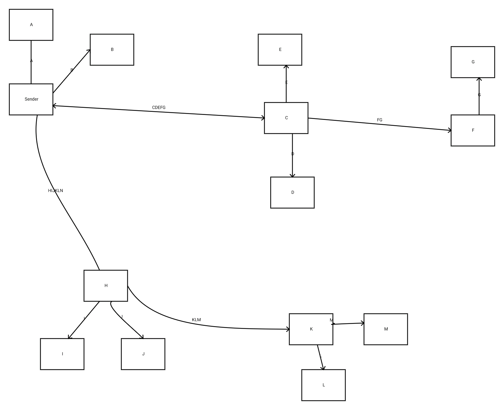

Multicast messaging should be a powerful tool for distributed applications in Datacenter clusters. The L2 definition of multicasting, in particular, is very well suited to datacenter communications:
* Maximum one-way transit times within a datacenter are relatively short. All recipients will either receive or not receive the message at about the same time, which is very quickly.
* Congestion Control within any L2 subnet is an easily solved problem. Brute-force traffic shaping can reserve bandwidth for a specific traffic class. Those options have been available for decades. Methods that preserve bandwidth while protecting traffic were specified with the Datacenter Bridging (DCB) enhancements. With these L2 traffic shaping features most applications can achieve drop-free delivery with simple transmit pacing.
* There are several applications where multicast enables send-once-receive-many messaging to get more real work done with fewer network resources.

This is because for any single switch, supporting L2 multicasting is simple:
* A multicast forwarding rule maps the L2 multicast address to the set of ports that each datagram must be delivered upon. A switch simply enqueues the multicast frame to the targeted set of ports and releases the frame once it has been transmitted on all of them. The only extra work for delivering to N ports rather than 1 port is keeping track of each port's delivery status.
* Learning multicast forwarding is easy within an L2 subnet which already has non-looping delivery of frames. The port where the "Join" request is heard is the one where that group's frames need to be delivered. Whatever variant of spanning tree is in use has already done all the heavy lifting.

Things, however, get complex once L3 is introduced. Now each multicast router (mrouter) needs to figure out the set of mrouters that each multicast datagram is to be forwarded to.

The problem? Multicast L3 addresses are not scoped in any way. Every multicast address is equally available to all multicast routers.

That is the last thing a network administrator wants when supporting multiple tenants. If Tenant X only has nodes off of two switches then Tenant X traffic should not be pesting any of the other switches in the data center.

At the L2 layer, VLANs can easily scope the set of switches where listeners **might** exist. This also allows easy management of the multicast address space by partitioning it into VLAN specific address spaces.

IP Addresses unfortunately do not directly represent VLANs except by assigning separate subnets to each VLAN. Those are separate **unicast** address ranges to each VLAN. With L3 glasses on the multicast address space is totally flat and painfully global.

If your ISP re-routes your last mile through a different laser transmitter only a handful of routers within its infrastructure must be informed. But if you subscribe to a multicast address, someone has to figure out how to tell every mrouter on the planet that **might** be transmitting that address to you.

This is why multicast support on the Internet backbone is close to non-existent.

Routing of unicast addresses is comparatively simple. The largest possible unicast prefix directs the datagram to the ISP, which can then apply more detailed routes to direct it to a specific geographic location and finally to the correct building or residence. Any multicast address, however, can literally be directed to any edge router on the entire planet. Subscribers can appear anywhere. The publisher can be anywhere.

I think you see why very few ISPs support multicast. Supporting unicast is simpler, and mandatory. You can't claim to provide an Internet service without unicast support.

## Multicasting Is Different for Datacenter Apps
Datacenter multicasting does not have the same needs as conventional wide-area multicasting.

Traditional multicast protocols have this strange model where the publisher does not know who is receiving the data. This is a relic of early Internet thinking that multicast would be used for tailored broadcasting. Subscribers would join and leave a multicast already in progress without having to inform the sender.

This model has not been widely deployed. One of the modern success stories cited by multicast champions is distribution of financial trading data. This is a very good fit for unreliable delivery because all information is updated periodically anyway.  Immediate retransmission for reliable delivery does not make sense in that environment. But the entities transmitting this data do know who their paid subscribers are.

The model for datacenter multicasting is to specify the recipients of a message as a precise subset of an enumerated set of cluster members. More importantly the precise set of nodes that should receive a given set of data to be processed is being driven by a master scheduler, not by the interest of the subscribers. The master scheduler needs to get data to a set of nodes that will all process it. But those nodes were not known at the start of the job, it has been influenced by when nodes have finished prior work. Under this model there is a finite set of possible targets, with a subset being chosen for a given distribution of data on a dynamic basis. That choice is made at the publishing end, not by the subscribers.

Examples include:
* Storage Clusters which must deliver multiple replicas of the same content to different storage targets.
* Multi-stage distributed compute jobs where the output of slice X of Stage N processing must be consumed by multiple nodes of Stage N+1 processing.

The BIER (Bit Indexed Explicit Replication, https://datatracker.ietf.org/wg/bier/about/) fits this model. The cluster is pre-enumerated. Each member is pre-assigned a bit index, and this information is shared by all nodes.

The interfaces proposed here will map directly to BIER once those networks are finally deployed and if cloud providers choose to expose those capabilities. This solution implements the API with overlay networking using only unicast messaging on the underlay network.

## Overlay Relay
The fundamental strategy for overlay multicast is to relay the packets with each node also acting as an mrouter:
* To reach all destination nodes you first partition the bitmap into a retained portion and a nearly equally sized subset that will be delegated. That subset will be retained in the message delivered to one member of that group.

* The datagram is then sent to the selected member of that group with the reduced set of targets.

* Those targets are then removed from the set of targets.

* This process continues on both this and the addressed node until there are no bits left to be delivered.

Of course it is very desirable to be topology aware when dividing the bitmap in half. The nodes assigned to one partition should have the highest affinity with each other.

Affinity is preferably determined by the LLDP identifier of the directly attached switch. Of course cloud providers that are militantly insisting that they provide an L3-only service are unlikely to expose LLDP messages to the containers. When LLDP identifiers are not available the IP subnet is used as the best available affinity.

The Affinity Group for each member of the cluster is declared when that node is assigned a bit index in the bitmask. Therefore the application layer can actually choose any method for assigning affinity that it desires. Techniques such as measuring round-trip times can fairly accurately measure a network topology even if it officially opaque.

It is also desirable to determine when affinity groups are reached via other affinity groups. If datagrams for Affinity Group Y go through a switch supporting Affinity Group X then it makes sense to include all destination bits for Groups X and Y in the same partition and to send the datagram to a member in Group X.

here can be multiple clusters. Each identifies:
* A nominal IP address that is used as the initial destination for datagrams sent to the cluster.
* One or more nodes: including:
  * Bit number.
  * Unicast IP Address.
  * Affinity.

Clusters are identified and enumerated by another sub-system, frequently a Keep-alive system.

## Datagram Filtering - No Dedicated MRouters
With overlay relay there are no dedicated MRouters. This eliminates dependency on network administrators to provide anything more than unicast delivery and QoS guarantees.

The "multicast routing" is performed by packet filters in the edge nodes. This packet filter can even be implemented in user mode software by working with bypass technologies like PF-Ring or DPDK.

Overlay Multicast is implemented with a datagram filter on each cluster node. Datagram filters process each eligible sent or received datagram. A datagram is recognized as an overlay multicast datagram based on the destination UDP port number and when it's destination IP address is either:
* The cluster designated unicast IP address.
* The specific node's unicast IP address as specified in a cluster definition.

The datagram filter replaces the headers, rather than encapsulates them. The transmitted datagram in comprised of:
* L2 and L3 headers with the destinations being for the specific target, and the original source addresses.
* A UDP header with configured source and destination port numbers.
* The Overlay Multicast header, with a modified Destination Set.
* The unmodified application payload.

The overlay multicast header specifies:
   * The Destination Set: BIER-compatible encoding with SI, Bitstring and Bitstring Length.
   * Application source/destination ports.

The filtered datagram may be delivered and/or retransmitted immediately to a subset of the received destinations.

Additional transmissions with successively smaller subsets of the original destination set. These should be scheduled after the initial transmission completes.

This strategy has only a very slight impact on the number of datagrams that can be delivered to nodes when compared to native multicast, as long as the switches have Priority Flow Control or equivalent capabilities.

The relay traffic reduces the available transmit capacity from storage targets. The application layer can reduce this impact by preferring to select nodes by factoring both the get and put queues on candidate nnodes rather than just the get or put queue that is being scheduled.

### Multicasting to Any Subset of Pre-identified Group
Overlay Multicasting supports delivery of datagrams to any subset of pre-enumerated clusters. The cluster is specified by a virtual IP address that selects the cluster and confirmed by the configured UDP destination port. This datagram is then delivered to the destination set by a series of unicast datagram transmissions.

This is illustrated in the following diagram:

A sender wishes to reach A thru M. A and B share the senders affinity. E, F and G share an affinity. G and H are a third affinity, but one reached via E, F and G's affinity.

Similarly H, I and J are in an affinity group, which is path to the affinity group holding K, L and M.

In the diagram the target set remaining for each forwarded instance of the datagram is shown.

In this example all nodes are reached within 4 transmissions. No inter-affinity link is traversed more than once. This is not as efficient as true multicast would have been, but it is far more efficient than having the sender iteratively unicast to all the destinations.

## Recurring Themes
The datagram forwarding strategies here are similar to, but different, than the methods for relaying chunks between federated NexentaEdge clusters.

Neither strategy requires a definitive network topology be fully enumerated.

Linking federated clusters is done over reliable fixed tunnels. There is a single entry point to each cluster (it probably is a virtual IP address which will migrate if necessary, but it is treated as a single entry point).

In contrast, Overlay Multicasting can use any node within an affinity-group as the entry point. The fact that a single multicast delivery may require retransmitting the same datagram multiple times makes it even more important that the probability of congestion drops be as close to zero as possible.

Forwarding between clusters without an explicit topology avoids loops by not transferring duplicate chunks to a cluster that already has a chunk. This contrasts with the spanning tree algorithm for avoiding loops by deactivating some links.

Overlay multicasting avoids loops by trimming the destination bitmask by at least one with each transmission. Like spanning tree, it is a very simple step. But the result is important for avoiding write amplification through overlay networking. That is why care is taken to partition the destination bitmask so that the inter-affinity links are only traversed once. These are the links most prone to congestion.

###  Using L2 Multicasting
The cluster may support any number of native L2 multicast addresses. For each the following is specified:
* The L2 multicast address.
* The destination bitmask that this address will reach.

If declared these addresses may be used to resolve multiple destination bits in a single native multicast transmission. However, network administrators reluctant to expose any L2 services are unlikely to provision these L2 multicast addresses.

## Why Traffic Shaping is Required
Using a UDP tunnel envelope keeps tunnel management simple. Each datagram can be encapsulated or decapsulated without complex state management.

However, this requires the hosts comply with a provisioned bandwidth or otherwise avoid network congestion. Because one datagram may be relayed two or three times **any** risk of congestion drops is compounded. Congestion-free delivery is essential.

Without some form of traffic shaping over the underlay network congestion-free delivery is not a safe assumption. It is also an improper assumption to make in that the risks are being shared with other traffic. The congestion caused may drop frames from other flows just as likely as from the application that decided to bypass normal congestion control.

IETF standards require UDP transmitters to implement TCP Friendly Rate Control, which can be done by:
* Limiting UDP bandwidth to a trickle. This is used by protocols such as DNS.
* Limiting UDP bandwidth to a rate below the bandwidth that was reserved for this traffic.
* By implementing a dynamic congestion control which is fair to all other traffic sharing the traffic class running TCP congestion control.

The Replicast storage transport protocol uses pacing of new transactions to limit the unsolicited UDP bandwidth and explicit reservations against a provisioned rate to throttle payload bandwidth. Different applications can use their own solutions.

## How Pacing Is Not Impacted and Impacted by Unicast Relay
For purposes of scheduling port reservations of payload capacity there is no impact from using unicast relay as opposed to true multicast.

The same datagrams are delivered to the egress port over the same duration of time. There is no change to the bandwidth throttling.

However, there are some major changes in the allocation of transmit capacity and of switch buffers.

Unicast relay jitters deliveries of datagrams to the egress ports. This increases the variance in queue depths, which ultimately requires slightly less aggressive utilization of bandwidth. Basically, the safety margins between packets has to be increased slightly over the long-run, even if no adjustment is required when planning on a packet-by-packet basis.

Replicast congestion control has always relied upon switch buffering and Priority Flow Control to protect it against clock drift. Conceptually each target is allowing at most one payload transfer to it at a time, but it did not have to sweat the "at a time" details. Switch buffering, especially with PFC, would swallow any accidental overlap in chunk transmissions to the same target without a problem. This assumes that the overall rate of granting payload reservations and of initiating new put requests were acting as outer guards to ensure that we didn't try to deliver 20 pounds of potatoes in a 10 pound bag. Those outer rate controls need to account for the higher variability.

More significantly, unicast relay creates a lot of additional outbound traffic from target nodes relaying frames. This rate has to be monitored, and accounted for in scheduling reads.

It does not matter if a specific read chunk transfer is jittered by relay traffic, as long as we keep the aggregate read traffic below the actual capacity as diminished by the bandwidth consumed for relay traffic.

# Bootstrapping the Cluster Roster
A node that has been assigned membership in a cluster will obtain a Cluster Roster by:
* Sending a Join Request to the Cluster's virtual IP address. The response will supply the roster including it as a new member.
* Or by it noting that nobody is answering the Virtual IP Address and attempting to claim that address for itself.

The cluster roster is returned as a serialized binary encoding of the following:
* N Affinity Groups:
   * 32-bit Affinity Group ID
   * N-Nodes:
       * 16-bit bit Index
       * 6-byte L2 Address
       * IP Address (4 or 16 bytes)
    * N Multicast Routes:
        * Multicast IP Address (4 or 16 bytes)
        * SI (all bit indexes start at 32*SI)
        * Bit string (4 byte bit string starting at SI).
    * N Direct-connections to Other Affinity Groups
      * Affinity Group ID (4 bytes)

When acting as the Roster Maintainer a node will propagate updates to the Roster via overlay multicast to the entire cluster.

Should the Roster Maintainer lose contact with the rest of the cluster the lower bit index survivor will assume leadership of the cluster.

# Summary
The options described here allow multicasting within an enumerated set of destinations to be implemented over any IP network. Packets are multicast to any subset of the cluster identified in the packet header. No use of multicast addresses, L2 or L3, is required.
