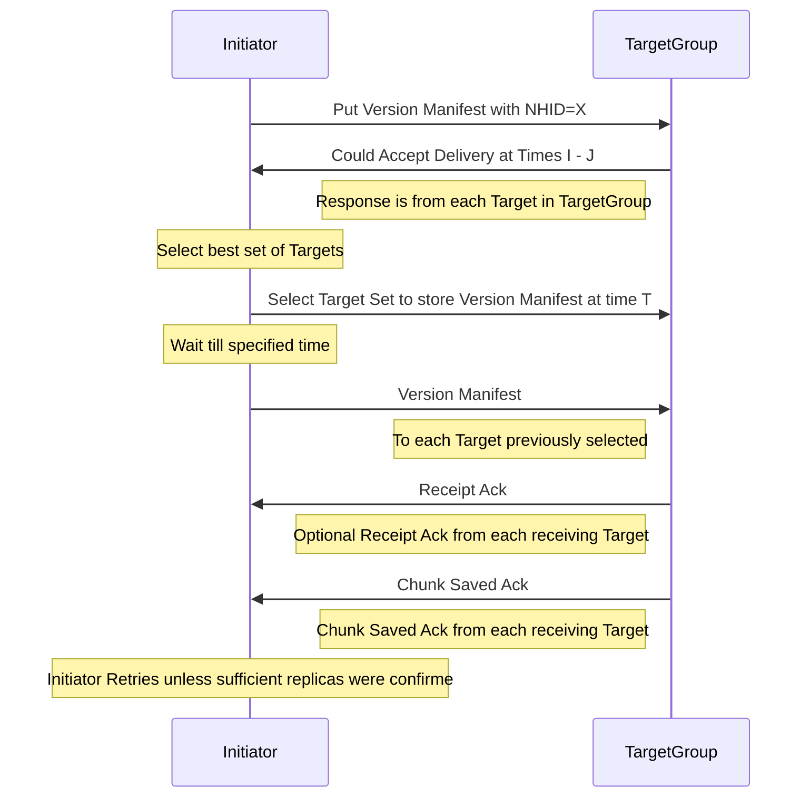

In the prior blog on NexentaEdge we mentioned that
Chunks were unique and immutable and that Chunk References
merely identify how a Chunk is used to rebuild an object,
but do not specify the locations where the chunk is stored.

This time we will expand on how the Location Independent
References are done.

The Version Manifest specifies a specific version of an object. It specifies the metadata for the version, including a few mandatory fields, and a series of Chunk References which reference the payload chunks.

A typical Chunk Reference contains:
* The CHID of the referenced chunk.
* The Logical Offset of the Chunk in the object version.
* The Logical Length of the decompressed payload.

What it does not specified is any locations where the replicas are held. This means that the content can be migrated either for maintenance or load-balancing purposes without updating the Version Manifest.

Actually lots of systems have location-free Chunks
References. What is different about NexentaEdge is
that the location-free Chunk References can specify
a dynamic set of locations that can change without
the add or drop of any storage target.

This is done by hashing the relevant cryptographic
hash (content or name) to a Negotiating Group rather
than to a set of target machines. Each Negotiating
Group has its own multicast group. Storing and
retrieving chunks is negotiated by multicast
requests on that group.

## Get Chunk with CHID
```sequence
Initiator->>TargetGroup: Get Chunk with CHID=X
TargetGroup->>Initiator: Have Chunk Can Deliver at T | Not here
Note left of TargetGroup: Response is from each Target in TargetGroup
Note over Initiator: Select best offer
Initiator->>TargetGroup: Select Target to Supply Chunk
Note over TargetGroup: Wait till specified time
TargetGroup->>Initiator: Requested Chunk
Note left of TargetGroup: From the selected target
Note over Initiator: Initiator validates received chunk, retries on error.
```

Payload chunks are found by multicasting a find
request identifying the CHID (Content Hash IDentifier)
of the desired chunk. This multicast group is hashed
from the CHID ("hash" being a very fancy mathematical
term for modding the CHID/NHID by the number of Negotiating Groups to get the index into the array of Multicast Groups).

Each receiving Target responds to the Initiator with
either an indication that it has Chunk X and could
deliver it at time Y, or that it does not have it.

Once sufficient replies have been received to make
a selection the Initiator multicast what selection
it has made. This is multicast to the same group so
that nodes not selected can cancel tentative resource
reservations.

Lastly the selected storage target delivers the requested
chunk at the specified time. Because this was negotiated,
a network with a non-blocking core can transmit the chunks
at the full rate provisioned for payload transfers.

## Put Chunk With CHID
```sequence
Initiator->>TargetGroup: Put Chunk with CHID=X
TargetGroup->>Initiator: Could Accept at Time I-J | Already Stored
Note left of TargetGroup: Response is from each Target in TargetGroup
Note over Initiator: Select best set of Targets
Initiator->>TargetGroup: Select Targets to Receive Chunk at Time T
Note over Initiator: Wait till specified time
Initiator->>TargetGroup: Chunk
TargetGroup->>Initiator: Receipt Ack
Note Left of TargetGroup: Optional Receipt Ack from each receiving Target
TargetGroup->>Initiator: Chunk Saved Ack
Note Left of TargetGroup: Chunk Saved Ack from each receiving Target
Note over Initiator: Initiator Retries unless sufficient replicas were confirmed
```

Of course before we can get Chunk X from somewhere
within a Negotiating Group we have to put it to that
group.

Each member of the group identifies when it could
accept the transfer. The Initiator picks the best
set of targets with an overlapping delivery window
to receive the required number of replicas.

The number of replicas can be reduced when some
replicas already exist. This message can also
complete the transaction if there are already
sufficient replicas.

There is also a nearly identical Replicate Chunk
transaction to test if there are sufficient replicas
of an already existing Chunk and to put this missing
replicas if there is not.

## Get Version Manifest With NHID
```sequence
Initiator->>TargetGroup: Get Version Manifest with NHID=X
TargetGroup->>Initiator: Have Version Manifest with UVID X Can Deliver at T | Not here
Note left of TargetGroup: Response is from each Target in TargetGroup
Note over Initiator: Select best offer
Initiator->>TargetGroup: Select Target to Supply Version Manifest
Note over TargetGroup: Wait till specified time
TargetGroup->>Initiator: Requested Version Manifest
Note left of TargetGroup: From the selected target
Note over Initiator: Initiator validates received Version Manifest, retries on error.
Note over Initiator: Typically then fetch the referenced chunks.
```

Of course a storage system that only allowed you to retrieve content previously stored if you remembered a 256 or 512 arbitrary identifier wouldn't be that useful. We need to put and get named objects. Typically we want the current version of a named object.

Each object version is described by a Version Manifest. Version Manifests are also Chunks, but they are assigned to Negotiating Groups based upon their fully qualified object name (a fully qualified name includes the Tenant name).

Current Version Manifests are found by multicast a
named find requesting identifying the NHID (Name hash
IDentier) of the Version Manifest desired. The default request
seeks the most current version stored by each target in the group.
The Group is derived from the NHID rather than the CHID.

Each receiving Target responds saying it could deliver
a Version Manifest with NHID X and UVID Y (the unique
version identifier, including the version's timestamp.
It is made unique by adding the original Initiator's
IP address as a tie-breaker).
Each is the most current version known to that Target.

Once sufficient replies have been collected, the
Initiator selects the Version Manifest it wants,
and multicasts it to the group. Again, this allows
the non-selected targets to release tentative resource
claims.

Lastly the selected storage target delivers the selected
Version Manifest to the Initiator at the negotiated
time at the configured full rate.

## Put Version Manifest


Putting a new Version Manifest is nearly identical
to putting a Payload Chunk, except that the Put
request is multicast to the NHID-derived group
(rather than CHID-derived) and that there will
not be a pre-existing Version Manifest with the
same UVID (Unique Version IDentifier).
